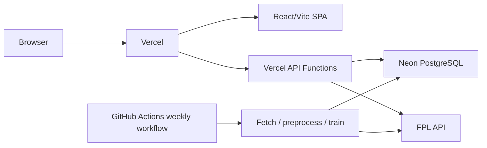

# FPL Geek — Vercel Migration Plan

## Decisions

- Continue implementation on the existing `vercel` branch.
- Deploy the frontend and lightweight API routes to Vercel Hobby/Free.
- Use Neon PostgreSQL for persistent application and training data.
- Use GitHub Actions for a scheduled weekly data refresh and model-training pipeline.
- Remove the Update Data button from the frontend.
- Preserve full historical training data and expose it through paginated/filterable API access.
- Do not run the current FastAPI server, SQLite writes, subprocesses, or ML training inside Vercel Functions.

## Target architecture

### Vercel

- React/Vite frontend
- SPA fallback routing
- Lightweight API functions
- FPL API proxy for allowed endpoints
- Neon-backed data endpoints

### Neon

Store:

- Players
- Teams
- Events
- Fixtures
- Current and historical player history
- Predictions
- League analysis
- Feature importance
- Backtest results
- Full preprocessed training data
- Data-version and update metadata

### GitHub Actions

Run weekly:

1. Fetch current and historical FPL data.
2. Build the local staging dataset.
3. Preprocess training data.
4. Train the Random Forest model.
5. Generate predictions and analysis results.
6. Validate the generated data.
7. Upload data to Neon in batches.
8. Mark the new data version active only after the upload succeeds.

## Migration phases

### 1. Measure and design the data model

- Measure the production SQLite database size and row counts.
- Identify all tables and fields used by the frontend.
- Create Neon/PostgreSQL migrations for the required tables and indexes.
- Preserve the current composite key for `player_history`.
- Add indexes for player, season, gameweek, position, and training-data queries.
- Add a `data_versions` table to track successful weekly updates.

Suggested tables:

- `players`
- `teams`
- `events`
- `fixtures`
- `player_history`
- `training_data`
- `predictions`
- `analysis_results`
- `data_versions`

Use typed columns for fields used in filtering/sorting and `jsonb` for flexible payloads such as fixture stats, metadata, and projections.

### 2. Migrate the existing dataset

- Keep SQLite as a local staging format for the Python pipeline initially.
- Add a Neon sync/import script using the PostgreSQL connection string.
- Upload existing data in batches.
- Make the import idempotent with upserts.
- Verify row counts and representative records after import.
- Ensure the last valid production version remains available if an update fails.

### 3. Refactor the Python pipeline

- Separate data generation from data publication.
- Keep `fetch_data.py`, `preprocess.py`, and `train_predict.py` usable locally.
- Add a publication step that reads the completed staging database and writes to Neon.
- Add retries, batching, validation, and clear failure reporting.
- Avoid replacing active production data until all tables and generated results are valid.
- Keep model artifacts in the GitHub Actions workspace or artifact storage; do not depend on a writable Vercel filesystem.

### 4. Add Vercel API routes

Add a Vercel-compatible API layer, likely under `api/`:

- `GET /api/health`
- `GET /api/bootstrap-static`
- `GET /api/data/predictions`
- `GET /api/data/fixtures`
- `GET /api/data/league-analysis`
- `GET /api/data/feature-importance`
- `GET /api/data/backtest-results`
- `GET /api/gameweek-context`
- `GET /api/training-data`
- `GET /api/data-version`
- `GET /api/fpl/*` for an allowlisted FPL proxy

The training-data endpoint must perform filtering, search, ordering, and pagination in Neon rather than loading the complete dataset into a serverless function or browser.

Protect Neon writes with a restricted database connection string, which must only be available to GitHub Actions and server-side API functions. Never expose it to frontend code.

### 5. Refactor the frontend

Replace old Render/backend-specific paths:

- Remove `/ai-api` prefixes.
- Remove `http://localhost:3000` calls from production code.
- Replace browser-side SQLite loading with Vercel API requests.
- Consolidate API paths in one client/service module.
- Fix the backtest endpoint to use a concrete API route.
- Remove the Render-specific `useKeepAlive` hook.
- Remove the Update Data button, polling, and update-status UI.
- Preserve full training-data browsing through the paginated endpoint.

The Vite development proxy may remain temporarily for local development, but production must use the Vercel routes.

### 6. Add the weekly GitHub Actions workflow

Create `.github/workflows/weekly-data-update.yml` with:

- Weekly cron schedule
- `workflow_dispatch` for manual runs
- Python setup and dependency installation
- Node setup only if preprocessing requires it
- Fetch, preprocess, train, predict, validate, and Neon sync steps
- Failure reporting
- Safe reruns and idempotent upserts

Required GitHub secrets:

- `DATABASE_URL` (Neon pooled connection string)
- `NEON_DATABASE_URL` (optional direct connection string for migrations or administrative tasks)

Add any future source/API credentials only as repository or environment secrets.

### 7. Configure Vercel

Add or update:

- `vercel.json`
- API function configuration
- SPA rewrite to `index.html`
- Production environment variables
- Cache headers for weekly data
- Build and output settings for the Vite frontend

The existing Dockerfiles and Nginx configuration are not used by Vercel. Keep them only if legacy self-hosting remains supported.

### 8. Test and cut over

Test locally and in a Vercel preview:

- SPA deep links and client-side routing
- All API routes
- Neon/PostgreSQL errors and timeouts
- FPL proxy failures
- Training-data pagination and search
- Large result sets
- Mobile UI behavior
- Weekly update success
- Failed update preserving the previous active version
- Safe rerun of an interrupted update

After validation:

1. Compare Vercel output with the current deployment.
2. Run at least one complete weekly update cycle.
3. Configure the production domain and DNS.
4. Promote the `vercel` branch deployment.
5. Monitor Vercel function errors, Neon usage, database connections, and GitHub Actions failures.

## Caching

Because data updates weekly:

- Cache bootstrap, fixtures, predictions, and analysis responses for several hours.
- Cache training-data pages by query parameters where practical.
- Give `/api/data-version` a short cache duration.
- Do not cache health responses.
- Use a new active data version so clients do not mix rows from different weekly updates.

## Security and free-tier safeguards

- Never expose the Neon connection string in Vercel client bundles.
- Allow only known FPL proxy paths.
- Enforce maximum `pageSize` values.
- Validate all query parameters.
- Add rate limiting or lightweight abuse protection to expensive endpoints.
- Restrict database writes to the GitHub Actions publisher and server-side API functions.
- Use PostgreSQL roles, grants, and Row Level Security where appropriate according to the final access policy.
- Use Neon branching for isolated migration/testing workflows where practical.
- Monitor Vercel function size, execution time, Neon compute/storage, connection usage, and GitHub Actions minutes.

## Open access decision

Before implementing database policies, decide whether full training data is:

1. Publicly readable without authentication;
2. Available only to authenticated application users; or
3. Available through a protected Vercel API/session.

The simplest initial implementation is publicly readable, paginated API access through server-side Neon queries with read-only database permissions. If the training data is not intended to be public, implement authentication before exposing the endpoint.
