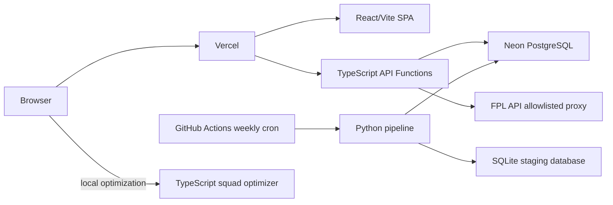

# FPL Geek — Vercel and Weekly Pipeline Plan

## Decisions

- Deploy the React/Vite application and read-only API functions to Vercel.
- Use Neon PostgreSQL as the production data store.
- Run fetching, preprocessing, model training, prediction generation, and publication in GitHub Actions once per week.
- Keep team optimization in the browser using the existing TypeScript solver; optimization must not call the backend.
- Keep SQLite only as a local/GitHub Actions staging format during the migration. It must not be downloaded by the browser or used by Vercel functions.
- Replace the current FastAPI/SQLite/Render runtime path instead of trying to run the current backend inside Vercel.
- Use an explicit `vercel` branch until the migration is complete, then merge or promote it to the production branch.

## Target architecture



### Stack

| Area | Choice |
|---|---|
| UI | React 19 + TypeScript + Vite |
| Hosting/API | Vercel SPA and TypeScript serverless functions |
| Database | Neon PostgreSQL |
| Serverless database driver | `@neondatabase/serverless` |
| Pipeline | Python, pandas, NumPy, scikit-learn, joblib |
| Scheduler | GitHub Actions cron plus `workflow_dispatch` |
| Optimization | Existing browser-side TypeScript solver |
| FPL integration | Server-side, allowlisted Vercel proxy |

Vercel Cron is not the primary scheduler because the pipeline is long-running and performs ML work. GitHub Actions provides a better environment for Python dependencies, temporary disk, logs, retries, and artifacts.

## Current blockers discovered

- There is no Vercel configuration, API directory, or weekly workflow.
- Frontend code still uses `/ai-api`, `http://localhost:3000`, Render keep-alive logic, and browser-loaded `fpl.sqlite`.
- `frontend/src/App.tsx` passes an empty `predictionsMap` to `PitchView`, so optimization receives zero forecasts.
- The optimizer is called without `gameweekMetadata` even though the hook accepts it.
- `backend/main.py` depends on mutable SQLite files, process state, background tasks, and shell subprocesses; these are not suitable for Vercel Functions.
- `backend/scripts/fetch_data.py` does not populate `events` or `element_types`, although the frontend requires them.
- The current training-data API fetches all matching rows before slicing, so pagination is not actually server-side.
- Preprocessing has hardcoded `2025/26` assumptions and must support `2026/27` and future seasons.
- The current Neon schema stores version IDs but uses global primary keys. Upserts can overwrite rows from the previous active version during a failed import.

## Migration phases

### Phase 1 — Establish the production data contract

1. Measure the current SQLite database size, row counts, and payload shapes.
2. Define typed contracts for bootstrap data, predictions, analysis results, training-data pages, and data-version metadata.
3. Decide whether training data is public. If it is private, authentication must be implemented before exposing the endpoint.
4. Add or verify PostgreSQL tables for:
     - `data_versions`
     - `players`
     - `teams`
     - `element_types`
     - `events`
     - `fixtures`
     - `player_history`
     - `training_data`
     - `predictions`
     - `analysis_results`
5. Preserve the `(player_id, fixture_id)` logical key for player history.
6. Add indexes for player, team, position, season, gameweek, fixture, prediction score, and training-data queries.

### Phase 2 — Make publication version-safe

The active dataset must remain readable while a new weekly dataset is being loaded. Prefer immutable versioned rows:

```text
primary key (data_version_id, entity_id)
```

Apply this pattern to players, teams, events, fixtures, histories, training rows, predictions, and analysis results. Keep `data_versions` as the atomic publication marker.

Expose active-only views or require every query to join the active version. For example:

```sql
create view active_predictions as
select p.*
from predictions p
join data_versions v on v.id = p.data_version_id
where v.status = 'active';
```

If the existing schema is retained, use separate staging tables and an atomic publication strategy instead. Do not rely on ordinary upserts against globally keyed production tables.

### Phase 3 — Complete and validate the Python pipeline

Keep these scripts locally runnable:

```text
backend/scripts/fetch_data.py
backend/scripts/preprocess.py
backend/scripts/train_predict.py
backend/scripts/validate_data.py       # add
backend/scripts/import_neon.py
```

Required sequence:

1. Fetch `bootstrap-static`, including players, teams, events, and element types.
2. Fetch fixtures and current player histories.
3. Fetch configured historical seasons.
4. Fetch league analysis.
5. Build the SQLite staging database.
6. Preprocess historical and future rows.
7. Train the Random Forest model and generate predictions.
8. Persist model metrics and prediction metadata.
9. Validate counts, positions, keys, gameweeks, prediction coverage, and feature dimensions.
10. Import the complete dataset into a staged Neon version.
11. Validate the imported version.
12. Activate the version only after every check succeeds.

Pipeline requirements:

- Populate and import `events` and `element_types`.
- Calculate season names instead of hardcoding `2025/26`.
- Use time-based validation for forecasting where practical; avoid random splits that leak future information.
- Make imports idempotent and safe to retry.
- Mark failed versions without changing the active version.
- Store model metrics and source snapshot metadata in `data_versions.metadata`.
- Keep joblib model files in the GitHub Actions workspace or artifacts; Vercel only serves generated predictions.

### Phase 4 — Add the Vercel API layer

Create a server-side TypeScript API layer, for example:

```text
api/
    health.ts
    data/bootstrap-static.ts
    data/fixtures.ts
    data/predictions.ts
    data/league-analysis.ts
    data/feature-importance.ts
    data/backtest-results.ts
    data/training-data.ts
    data/version.ts
    gameweek-context.ts
    fpl/[...path].ts
```

Routes:

```text
GET /api/health
GET /api/data/bootstrap-static
GET /api/data/fixtures
GET /api/data/predictions
GET /api/data/league-analysis
GET /api/data/feature-importance
GET /api/data/backtest-results
GET /api/data/training-data
GET /api/data-version
GET /api/gameweek-context
GET /api/fpl/bootstrap-static
GET /api/fpl/fixtures
GET /api/fpl/entry/:teamId
GET /api/fpl/entry/:teamId/event/:gameweek/picks
GET /api/fpl/element-summary/:playerId
GET /api/fpl/entry/:teamId/transfers
```

API rules:

- Use `@neondatabase/serverless` and a server-only `DATABASE_URL`.
- Query only the active data version.
- Use parameterized SQL and validate all route/query parameters.
- Enforce a maximum training-data page size, for example 100.
- Apply `LIMIT`, `OFFSET`, ordering, filtering, and `COUNT` in PostgreSQL.
- Do not return the SQLite database.
- Do not allow arbitrary external URLs through the FPL proxy.
- Return consistent errors and short timeouts.

### Phase 5 — Refactor the frontend

Create one typed client such as `frontend/src/services/apiClient.ts` and route all application data through it.

Required changes:

- Remove `/ai-api` prefixes.
- Remove `http://localhost:3000` production calls.
- Replace `SqliteProvider`/`sql.js` browser loading with API requests.
- Remove `useKeepAlive` and its Render-specific polling.
- Remove `UpdateButton`, update polling, and client-triggered backend updates.
- Replace the invalid backtest path with a concrete API route or remove the unfinished feature.
- Pass `aiPredictionMap` into `PitchView` and convert it into valid `PredictionResult` objects.
- Pass `gameweekMetadata` to `useOptimization`.
- Define behavior for missing or stale predictions.
- Display the active data version rather than an update-in-progress state.

The browser optimization flow must be:

```text
FPL team + active predictions + fixtures → TypeScript solver → lineup/transfers
```

No optimization request should be sent to Vercel.

### Phase 6 — Add Vercel configuration

Add `vercel.json` with:

- Vite build configuration.
- `frontend/dist` output handling, or configure the Vercel project root as `frontend`.
- SPA fallback to `index.html` for non-API routes.
- API function routing.
- Cache headers for weekly data.

The existing `frontend/Dockerfile`, `frontend/nginx.conf`, and `backend/Dockerfile` are not part of the Vercel runtime. Keep them only if VPS/Docker self-hosting remains supported.

Update `frontend/vite.config.ts` so local development proxies the same explicit paths used in production. Do not proxy all `/api` requests directly to the FPL API because that conflicts with application API routes.

### Phase 7 — Automate the weekly refresh

Create `.github/workflows/weekly-data-update.yml` with:

- A weekly `schedule`.
- `workflow_dispatch` for manual execution.
- Concurrency protection so two publications cannot overlap.
- Python 3.11 or the selected supported version.
- Dependency caching and installation from `backend/requirements.txt`.
- A temporary `FPL_DATA_DIR` staging directory.
- Fetch, preprocess, train, validate, and import steps.
- Failure logs and staging artifacts.
- A stable version key based on source snapshot or workflow run.

Required GitHub secrets:

```text
NEON_DATABASE_URL
```

Use a direct or pooled Neon URL according to the importer and connection limits. Never expose it as a frontend `VITE_*` variable.

### Phase 8 — Test and cut over

Add tests before production cutover.

Frontend:

- Solver budget and three-player-per-team constraints.
- Legal formations and bench ordering.
- Transfer allowances and selling prices.
- Blank and double gameweeks.
- Missing prediction behavior.
- Prediction-to-solver mapping.
- API client error handling.

Pipeline/API:

- Season detection, including `2026/27`.
- Fetcher and staging row counts.
- Prediction output shape.
- Training-data SQL pagination and search.
- Active-version filtering.
- Import idempotency.
- Failed import preserving the previous active version.
- Atomic activation after validation.
- FPL proxy allowlist.

Preview validation:

1. Run the full pipeline manually.
2. Verify Neon row counts and representative records.
3. Verify every API route from a Vercel preview.
4. Test SPA deep links and mobile layouts.
5. Run the browser optimizer with real predictions.
6. Run a failed publication simulation and verify rollback behavior.
7. Complete one successful weekly refresh before switching DNS/production traffic.

## Caching

- Cache bootstrap, fixtures, predictions, and analysis responses for several hours.
- Cache training-data pages briefly using query parameters as part of the cache key.
- Cache `/api/data-version` for only a few minutes.
- Do not cache `/api/health`.
- Use the active version consistently so clients do not mix rows from different weekly publications.

## Security and free-tier safeguards

- Keep Neon credentials server-side and in GitHub secrets only.
- Use a read-only database role for Vercel API functions where possible.
- Enforce query limits and validate ordering fields against an allowlist.
- Allow only known FPL proxy paths and methods.
- Avoid returning full training data in a single response.
- Add basic abuse protection or rate limiting to expensive routes.
- Use Neon branches for migration testing where practical.
- Monitor Vercel function errors, execution time, Neon connections/storage, and GitHub Actions minutes.

## Definition of done

- The Vercel deployment serves the SPA with working deep links.
- The frontend has no `/ai-api`, localhost, Render keep-alive, or browser SQLite dependency.
- Vercel APIs read only the active Neon version.
- The optimizer produces non-zero recommendations using current predictions entirely in the browser.
- GitHub Actions can run the complete weekly refresh manually and on schedule.
- A failed refresh leaves the previous active data version available.
- A successful refresh publishes players, teams, events, element types, fixtures, history, training rows, predictions, and analysis results atomically.
